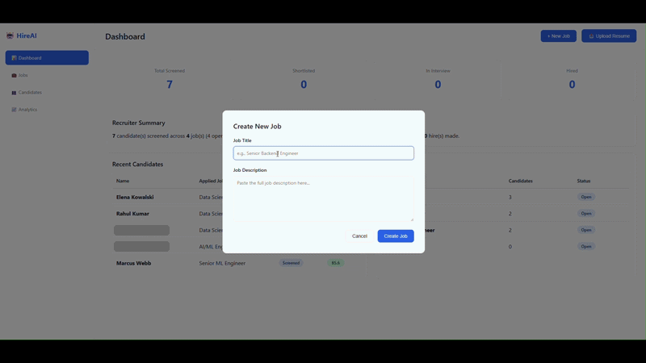
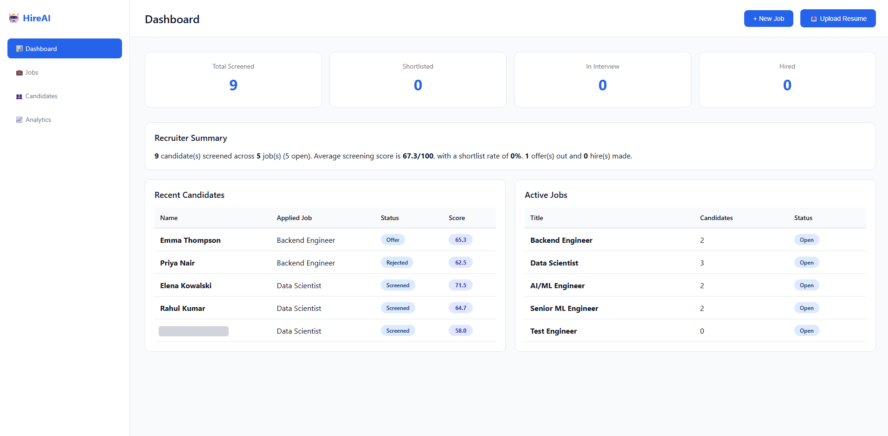
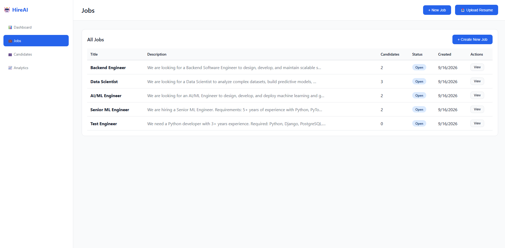
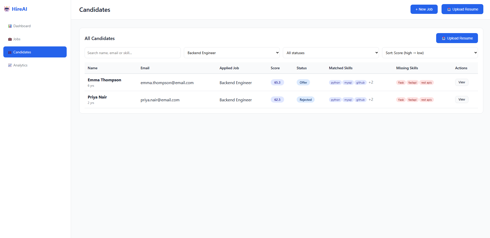
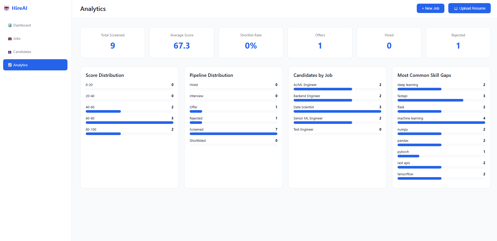
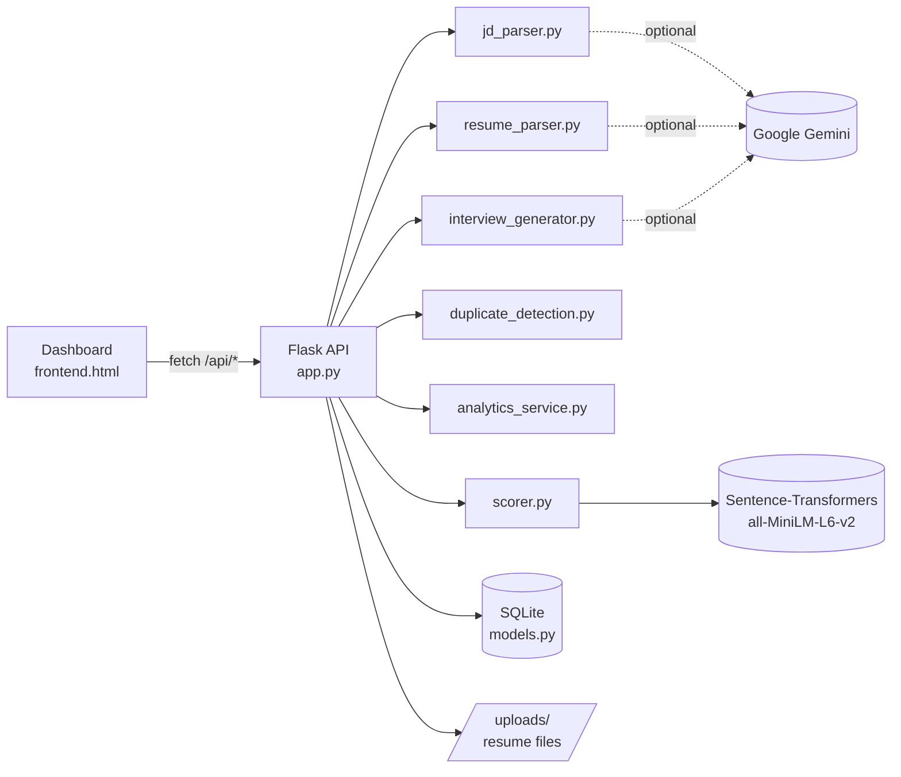

# HireAI — AI Resume Screening & Recruiter Dashboard

[](https://www.python.org/)
[](https://flask.palletsprojects.com/)
[](#testing)
[](LICENSE)

HireAI screens resumes against a job description, gives every candidate an explainable 0–100 score, and gives recruiters a dashboard to track candidates through the hiring pipeline.

It started as a command-line screening agent. The original parsing and scoring engine is unchanged; a Flask API, a SQLite database, and a web dashboard were built on top of it. The CLI still works.

Repository: https://github.com/MuthuVarshith/Hire-AI

---

## Demo



The demo walks through the core recruiter loop: create a job from a pasted job description, upload a resume against it, and see the candidate appear with a score, matched skills and missing skills.

---

## Screenshots

### Dashboard



The landing page gives a recruiter the state of hiring at a glance:

- **Metric cards** for total candidates screened, shortlisted, in interview and hired.
- **Recruiter Summary**, a plain-language sentence built from the live database: number of candidates and jobs, average screening score, shortlist rate, and offers and hires made.
- **Recent Candidates**, the five most recent candidates, showing the job each applied to, their pipeline status badge and their score.
- **Active Jobs**, each job with its candidate count and status.

### Jobs



Every job posting in one table: title, a preview of the description, number of candidates, status, and creation date.

- **+ Create New Job** opens a form where you paste a full job description. The backend extracts required skills, preferred skills, minimum experience and education from it.
- **View** opens the Candidates page filtered to that job.
- A job is **Open** until at least one of its candidates is marked *Hired*, then it shows **Filled**. This is derived from candidate records; jobs have no separately stored status.

### Candidates



The main working view. Each row shows the candidate's name and years of experience, email, applied job, a color-coded score, their pipeline status, and skill tags: **blue for matched required skills, red for missing ones**.

- **Search** by name, email or any skill on the resume.
- **Filter** by job and by pipeline status. The screenshot shows the list filtered to *Backend Engineer*.
- **Sort** by score, name, or most recent.
- **View** opens the candidate profile: contact details, education, full score, matched and missing skills, the AI-generated explanation, a pipeline status selector, and a link to download the original resume.
- **Score** appears only on candidates that don't have a score yet, so you can retry scoring for them.

### Analytics



Hiring metrics calculated from the records stored in the database, not sample numbers:

- **Headline metrics**: total screened, average score, shortlist rate, offers, hires and rejections.
- **Score Distribution**: how many candidates fall into each 20-point score band.
- **Pipeline Distribution**: candidate count at each stage, from Screened through Hired and Rejected.
- **Candidates by Job**: how many candidates each job has.
- **Most Common Skill Gaps**: the required skills candidates are most often missing. This shows where the talent pool is thin, or where a job description may be asking for too much.

---

## Features

| Area | What it does |
|---|---|
| **Resume parsing** | Reads `.txt`, `.pdf` and `.docx` files and extracts name, email, phone, skills, years of experience, education and work history |
| **Job description parsing** | Extracts title, required and preferred skills, minimum experience and required education from pasted text |
| **Explainable scoring** | Four scores (semantic, skills, experience, education) combined into one weighted 0–100 score, with the breakdown stored for each candidate |
| **Skill gap analysis** | Matched and missing required skills for each candidate; a skill counts as matched on exact or fuzzy similarity (embedding similarity > 0.7) |
| **Candidate database** | Candidates, jobs and screening results are saved in SQLite, so they survive restarts |
| **Duplicate detection** | Re-uploading someone already added to the same job is rejected, based on exact email, normalized phone number, or a >90% fuzzy name match |
| **Hiring pipeline** | `Screened → Shortlisted → Interview → Offer → Hired / Rejected`, changed from the candidate profile |
| **Analytics** | Metrics and charts calculated live from database records |
| **AI explanations (optional)** | With a Google Gemini API key, candidates get a short written explanation of their score; without one, a template-based explanation is used |
| **Scoring templates** *(API only)* | Named weight presets per role, stored in the database. Five presets are included; there is no page for them in the dashboard yet |
| **Interview questions** *(API only)* | Generates technical, resume-based, skill-gap and behavioral questions for a candidate; not yet shown in the dashboard |

---

## How scoring works

Each candidate is scored against the job on four signals. Each signal is scored 0–100, then they are combined using the default weights:

| Signal | Weight | How it is calculated |
|---|---|---|
| **Semantic similarity** | 40% | Cosine similarity between embeddings of the whole resume and the whole job description (`all-MiniLM-L6-v2`) |
| **Skill match** | 30% | Share of the job's required skills found on the resume, by exact or fuzzy match |
| **Experience** | 15% | `min(100, candidate_years / required_years × 100)` |
| **Education** | 15% | The candidate's highest degree compared with the job's requirement on a degree ladder |

```text
Overall = 0.40 × Semantic + 0.30 × Skills + 0.15 × Experience + 0.15 × Education
```

The weights live in [config.py](config.py). More detail and edge cases are in [scoring_method.md](scoring_method.md).

---

## Architecture



Flask serves the dashboard at `/` and the API under `/api`. They share an origin, so the browser needs no CORS setup.

**Upload and scoring flow**

```text
Upload resume → validate type and size → save to uploads/ → parse resume
  → duplicate check → store candidate → POST /api/screen → score 4 signals
  → store result with explanation → dashboard, candidates and analytics update
```

---

## Tech stack

| Layer | Technology |
|---|---|
| Backend | Python, Flask, Flask-CORS |
| Database | SQLAlchemy ORM on SQLite |
| NLP / scoring | Sentence-Transformers (`all-MiniLM-L6-v2`), NumPy |
| Optional LLM | Google Gemini (`gemini-2.0-flash`) |
| Document parsing | PyPDF2, python-docx |
| Duplicate matching | fuzzywuzzy, python-Levenshtein |
| Frontend | Plain HTML, CSS and JavaScript; no build step |
| Testing | pytest |

---

## Getting started

### 1. Install dependencies

```bash
pip install -r requirements.txt
```

On the first run the embedding model (about 90 MB) downloads automatically.

### 2. Configure environment variables (optional)

```bash
cp .env.example .env
```

On Windows PowerShell, use `copy .env.example .env`.

Everything works without editing `.env`. The settings you're most likely to change:

| Variable | Default | Purpose |
|---|---|---|
| `GOOGLE_API_KEY` | *(unset)* | Turns on Gemini-based parsing and written explanations. Without it, regex parsing and template explanations are used |
| `DATABASE_URL` | `sqlite:///recruiting_agent.db` | SQLAlchemy connection string |
| `MAX_RESUME_SIZE_MB` | `10` | Upload size limit |
| `ALLOWED_RESUME_EXTENSIONS` | `.txt,.pdf,.docx` | Accepted resume file types |
| `HOST` / `PORT` | `127.0.0.1` / `5000` | Server address, used by `python app.py` |

Never commit `.env`; it is already in `.gitignore`.

### 3. Database setup

No manual setup is needed. On startup the app creates `recruiting_agent.db` and its tables, and adds the default scoring templates.

To start with an empty database, stop the server, delete `recruiting_agent.db`, and start it again.

`recruiting_agent.db` and `uploads/` hold candidate personal data and are excluded from Git.

### 4. Run the app

```bash
python start.py
```

`start.py` loads the embedding model, then starts the server. When you see `Running on http://127.0.0.1:5000`, open:

**http://127.0.0.1:5000**

> **Open the app through that URL, not by double-clicking `frontend.html`.** A page opened from disk (`file://`) is blocked by the browser from calling the local API, so jobs and uploads fail.

> **Auto-reload is off.** When the scoring model loads, Flask's auto-reloader mistakes the import for a code change and restarts the server mid-request, which caused uploaded resumes to go unscored. After editing Python code, restart the server yourself.

---

## Deployment (Hugging Face Spaces)

The app ships as a Docker image that runs on a free CPU [Hugging Face Space](https://huggingface.co/docs/hub/spaces-sdks-docker). The [Dockerfile](Dockerfile) installs CPU-only PyTorch, bakes the embedding model into the image, and serves the app with gunicorn on port 7860.

**Run the container locally**

```bash
docker build -t hire-ai .
```

```bash
docker run --rm -p 7860:7860 hire-ai
```

Then open http://127.0.0.1:7860.

**Deploy to a Space**

```bash
pip install -U huggingface_hub
```

```bash
hf auth login
```

```bash
python deploy/deploy_hf.py
```

This creates (or updates) the Space `<your-username>/hire-ai` and uploads the app. The first build takes several minutes; follow it in the Space's **Logs** tab. Run the same command again to redeploy after changes.

[deploy/deploy_hf.py](deploy/deploy_hf.py) uploads through the Hub API rather than `git push`, because a Space's git remote rejects binary files that aren't stored with Xet/LFS, and this repository's history contains screenshots. It skips `docs/`, `tests/` and local data, and publishes [deploy/hf_space_readme.md](deploy/hf_space_readme.md) as the Space's README.

**Optional settings.** To enable Gemini explanations, add `GOOGLE_API_KEY` under the Space's **Settings → Variables and secrets** as a secret, not a variable.

**Data persistence.** The database and uploads live inside the container, so they reset when the Space restarts, sleeps or rebuilds. To keep them, enable persistent storage on the Space and set these variables:

| Variable | Value |
|---|---|
| `DATABASE_URL` | `sqlite:////data/recruiting_agent.db` |
| `UPLOAD_FOLDER` | `/data/uploads` |

**Public access.** A public Space has no login: anyone with the link can view, edit and delete everything. Use only sample resumes, or deploy with `--private`.

---

## Example workflow

1. **Create a job.** Click **+ New Job**, enter a title, paste the full job description, and click **Create Job**. Required skills and experience are extracted automatically.
2. **Upload resumes.** Click **Upload Resume**, pick the job, choose a file, and click **Upload**. The candidate is parsed, checked for duplicates, saved and scored in one step. A message shows the score.
3. **Review candidates.** On **Candidates**, filter to the job and sort by score. Compare matched (blue) and missing (red) skills.
4. **Open a profile.** Click **View** to see the full score, the AI-generated explanation and education, or to download the original resume.
5. **Move them through the pipeline.** In the profile, change the status to Shortlisted, Interview, Offer, Hired or Rejected. The dashboard and analytics update.
6. **Check the funnel.** Use **Analytics** to see score distribution, pipeline stages and the most common skill gaps.

To try it with sample data, use the job description in [sample_jd/jd.txt](sample_jd/jd.txt) and the ten resumes in [sample_resumes/](sample_resumes/).

---

## API reference

All endpoints return JSON. Errors come back as `{"error": "..."}` with a matching HTTP status.

### Jobs

| Method | Endpoint | Description |
|---|---|---|
| `POST` | `/api/jobs` | Create a job. Body: `{"title", "description_text", "scoring_template_id"?}` |
| `GET` | `/api/jobs` | List all jobs |
| `GET` | `/api/jobs/<id>` | Get one job |
| `PUT` | `/api/jobs/<id>` | Update title, description or scoring template |
| `DELETE` | `/api/jobs/<id>` | Delete a job and its candidates |

### Candidates

| Method | Endpoint | Description |
|---|---|---|
| `POST` | `/api/candidates?job_id=<id>` | Upload a resume (`multipart/form-data`, field `resume`). Returns `409` for a duplicate |
| `GET` | `/api/candidates` | List candidates with latest score. Query: `job_id`, `status`, `sort_by=score` |
| `GET` | `/api/candidates/<id>` | Candidate details and screening history |
| `PUT` | `/api/candidates/<id>` | Update `status` and/or `notes` |
| `GET` | `/api/candidates/<id>/resume` | Download the original resume |
| `DELETE` | `/api/candidates/<id>` | Delete a candidate and their resume file |

### Screening and interview questions

| Method | Endpoint | Description |
|---|---|---|
| `POST` | `/api/screen/<candidate_id>/<job_id>` | Score a candidate against a job. Optional body `{"use_llm": false}` |
| `GET` | `/api/screening/<id>` | Get a stored screening result |
| `GET` | `/api/candidates/<cid>/jobs/<jid>/interview-questions` | Generate interview questions for a scored candidate |

### Scoring templates

| Method | Endpoint | Description |
|---|---|---|
| `GET` | `/api/scoring-templates` | List templates |
| `POST` | `/api/scoring-templates` | Create a template. The four weights must sum to 1.0 |
| `GET` / `PUT` / `DELETE` | `/api/scoring-templates/<id>` | Read, update or delete a template. The default template can't be deleted |

### Analytics and health

| Method | Endpoint | Description |
|---|---|---|
| `GET` | `/api/analytics/dashboard` | Counts, average score, score and pipeline distribution, candidates by job, skill gaps |
| `GET` | `/api/analytics/jobs/<id>` | The same metrics for one job, plus a 30-day screening timeline |
| `GET` | `/api/analytics/top-candidates?limit=10` | Highest-scoring candidates |
| `GET` | `/api/health` | Health check |

**Example calls**

```bash
curl -X POST http://127.0.0.1:5000/api/jobs -H "Content-Type: application/json" -d "{\"title\": \"Backend Engineer\", \"description_text\": \"3+ years Python, Django, PostgreSQL. Bachelor's degree.\"}"
```

```bash
curl -X POST "http://127.0.0.1:5000/api/candidates?job_id=1" -F "resume=@sample_resumes/resume_01_ananya_patel.txt"
```

```bash
curl -X POST http://127.0.0.1:5000/api/screen/1/1
```

---

## Command-line mode

The original CLI agent still ranks a folder of resumes without the web app or database:

```bash
python main.py --jd sample_jd/jd.txt --resumes sample_resumes --output output --no-llm
```

It writes ranked results to `output/ranked_results.json` and `output/ranked_results.csv`.

---

## Testing

```bash
python -m pytest tests/ -v
```

33 tests across two files:

- [tests/test_agent.py](tests/test_agent.py): the original scoring engine, data models and output files.
- [tests/test_platform.py](tests/test_platform.py): database models, weight validation, duplicate detection and analytics calculations.

---

## Troubleshooting

| Problem | Fix |
|---|---|
| Create Job or Upload shows "Could not reach the backend" | Start `python start.py` and open http://127.0.0.1:5000, not the HTML file |
| An uploaded candidate has no score | Click **Score** on that row in Candidates. If it keeps failing, make sure the server was started with `start.py` |
| First scoring after startup is slow | The embedding model is loading; `start.py` loads it before accepting requests |
| "has already been added for this job" | Duplicate detection found the same email, phone or name for that job |
| PDF parses to an empty profile | The PDF is a scanned image with no text layer; use a text-based PDF, DOCX or TXT |
| Port 5000 is in use | Stop the other process, or set `PORT` in `.env` and run `python app.py` |

---

## Limitations

- **Single user, no login.** Anyone who can reach the server can see and change all data. Don't expose it to the internet as-is.
- **SQLite by default.** `DATABASE_URL` accepts any SQLAlchemy URL, but PostgreSQL needs a driver such as `psycopg2-binary`, which isn't in `requirements.txt` and hasn't been tested.
- **Skill extraction without an API key uses a fixed keyword list.** Skills not on that list, and job descriptions that don't use recognizable section headings, can produce fewer required skills. A job with no extracted required skills gives every candidate a full skill score.
- **Scoring templates and interview questions are API-only.** Jobs use the default weights unless a template ID is set through the API.
- **Development server.** Flask's built-in server isn't meant for production traffic.
- **Needs a server with memory and a disk.** The app runs PyTorch and writes to SQLite and an uploads folder, so serverless and static hosts (Vercel, Netlify) don't work. Use a container host such as Hugging Face Spaces.

---

## Responsible AI

HireAI is built to **assist** recruiters, not to make hiring decisions.

- **Job-relevant signals only.** Scores come from resume text similarity, skills, years of experience and education level. Name, gender, age, ethnicity, religion, nationality, marital status and photographs are not scoring inputs.
- **Explainable.** Every score is broken into its four parts, with the exact matched and missing skills, so a recruiter can see why a candidate scored as they did.
- **AI content is labeled.** Written explanations are marked *AI-generated* in the candidate profile.
- **Humans decide.** Pipeline status only changes when a recruiter changes it.
- **Known risks.** Semantic similarity rewards resumes that use similar wording to the job description, and education scoring can disadvantage self-taught candidates. Review low scores before rejecting anyone, and don't use the score as the only filter.
- **Candidate data stays local.** The database and uploaded resumes are stored on your machine and excluded from Git. With a Gemini key set, resume and job text is sent to Google's API for parsing.

---

## Project structure

```text
Hire-AI/
├── start.py                  # Recommended entry point: loads model, starts server
├── app.py                    # Flask API + serves the dashboard at /
├── frontend.html             # Recruiter dashboard (Dashboard, Jobs, Candidates, Analytics)
├── models.py                 # SQLAlchemy models: Job, Candidate, ScreeningResult, ScoringTemplate
├── analytics_service.py      # Metrics computed from database records
├── duplicate_detection.py    # Email / phone / fuzzy-name duplicate checks
├── interview_generator.py    # Candidate-specific interview questions
├── scorer.py                 # Four-signal scoring engine (original)
├── resume_parser.py          # Resume extraction (original)
├── jd_parser.py              # Job description extraction (original)
├── ranker.py                 # Ranking and explanations for the CLI (original)
├── config.py                 # Default weights, model names, data classes
├── main.py                   # CLI entry point (original)
├── utils.py                  # File discovery and CSV/JSON output
├── scoring_method.md         # Scoring methodology in detail
├── requirements.txt
├── .env.example
├── Dockerfile                # Container image (Hugging Face Spaces, local Docker)
├── deploy/
│   ├── deploy_hf.py          # Create/update the Hugging Face Space
│   └── hf_space_readme.md    # README published on the Space
├── docs/
│   ├── demo.gif
│   └── screenshots/          # dashboard, jobs, candidates, analytics
├── sample_jd/                # Sample job description
├── sample_resumes/           # 10 sample resumes
├── output/                   # Sample CLI output
└── tests/
    ├── test_agent.py
    └── test_platform.py
```

---

## License

MIT. See [LICENSE](LICENSE).
